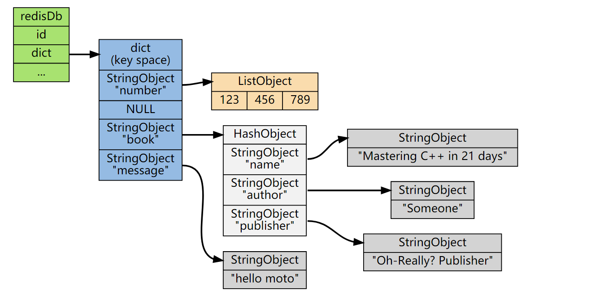

# redis

## 作用

- 缓存
- 数据库
- 消息队列

## 性能

- 内存
- reactor pattern = epoll + thread

## 数据类型

### 底层数据类型

- int：整数
- raw：字符串
- linkedlist：双端链表
- ziplist：压缩列表
- skiplist：跳跃表
- ht：字典
- intset：整数集合

### redisObject

- type：类型
- encoding：编码
- lru：LRU时间
- refcount：引用计数
- ptr：底层数据类型

### redis数据类型

- string：字符串
  - 编码：整数/字符串
- list：列表
  - 编码：双端链表/压缩列表
- hash：哈希表
  - 编码：压缩列表/字典
- set：集合
  - 编码：字典/整数集合
- zset：有序集合
  - 编码：跳跃表/压缩列表

## redisDb

- id：编号
- dict：键空间，包含所有键值对

- expires
- blocking_keys
- ready_keys
- watched_keys

## redisServer

- redisDb

## 持久化

- RDB：redis database，快照
- AOF：append only file，日志

## 高可用

- 主从模式
- 哨兵模式
- 集群模式
  - redis cluster
    - [Redis Cluster Specification](https://redis.io/topics/cluster-spec)
    - [Highly Available Redis](https://redislabs.com/redis-enterprise/technology/highly-available-redis/)
    - [First Step to Redis Cluster](https://blog.usejournal.com/first-step-to-redis-cluster-7712e1c31847)
    - [Life in a Redis Cluster: Meet and Gossip with your neighbors](https://cristian.regolo.cc/2015/09/05/life-in-a-redis-cluster.html)
    - [Introduction to redis cluster and gossip protocol](https://developpaper.com/introduction-to-redis-cluster-and-gossip-protocol/)
    - [In-depth Analysis of Redis Cluster Gossip Protocol](https://www.alibabacloud.com/blog/in-depth-analysis-of-redis-cluster-gossip-protocol_594706)
    - [Introduction to Redis Cluster](http://intro2libsys.com/focused-redis-topics/day-one/intro-redis-cluster)
    - [Clustering and High Availability](http://intro2libsys.info/introduction-to-redis/clustering-and-ha)
    - [一万字详解 Redis Cluster Gossip 协议](https://zhuanlan.zhihu.com/p/328728595)
  - [codis](https://github.com/CodisLabs/codis)
  - [tendis](https://github.com/Tencent/Tendis)

||redis cluster|codis|tendis|dynamo|
|-|-|-|-|-|
|partition|slot|slot||consistent hashing|
|replication|master-slave|master-slave||quorum|
|membership|gossip|gossip|gossip|gossip|
|engine|redis|redis|rocksdb||

